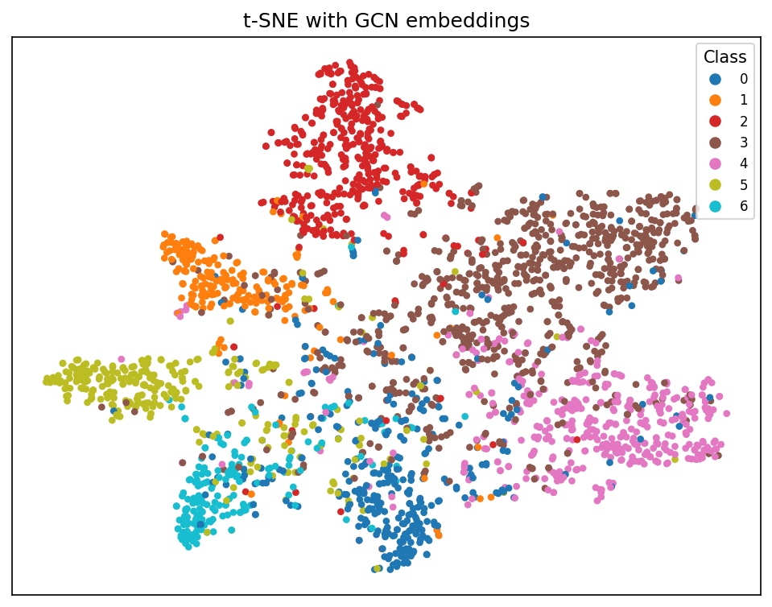

# Classifying Nodes in a Citation Network with Graph Neural Networks

## 1. Intro

This project studies node classification on citation networks. Networks each node is a research paper, each edge is a citation between two
papers, and the label of a node is the paper's research topic. The task is to
predict the topic of a paper from information in the graph.

The project is *semi-supervised*: only a small subset of the nodes have known
labels, but the features of all nodes and the full citation structure are
available during training. My main question is using the graph
structure helps prediction, compared to looking at each
paper's features in isolation?

To answer this, I compare two baselines that ignore the graph with three GNN
architectures that exploit it (GCN, GraphSAGE, and GAT). I also study how the
number of layers, the dropout rate, and the embedding size effect performance.

## 2. Dataset and structural analysis

I use three classic citation datasets provided by PyTorch Geometric: *Cora*, *Citeseer*, and *PubMed*. Each contains a single
graph with a fixed train/validation/test.

| Dataset  | Nodes  | Features | Classes | Train / Val / Test |
|----------|--------|----------|---------|--------------------|
| Cora     | 2,708  | 1,433    | 7       | 140 / 500 / 1000   |
| Citeseer | 3,327  | 3,703    | 6       | 120 / 500 / 1000   |
| PubMed   | 19,717 | 500      | 3       | 60 / 500 / 1000    |

The main property of citation networks is *homophily*: papers tend to cite other
papers on the same topic, so most edges connect nodes of the *same* class. I
measure this with the intra-class edge ratio:

| Dataset  | Avg. degree | Intra-class edge ratio |
|----------|-------------|------------------------|
| Cora     | 3.9       | 0.81                  |
| Citeseer | 2.74       | 0.736                  |
| PubMed   | 4.5       | 0.802                  |

A high intra-class ratio is important: it means a node's neighbours are usually
good predictors of its label, which is precisely the signal a GNN can use and
a feature only baseline cannot.

## 3. Methods

### Baselines

- *Logistic Regression* — a linear classifier from scikit-learn trained on the raw
  node features only. It is fast and provides a lower bound on features.
- *MLP* — a small neural network applied independently to each
  node's features. Like Logistic Regression it ignores the edges, but it can
  model non linear relationships in the features.

Comparing these two methods tells us how much of the accuracy comes from the
features rather than from the graph structure.

### Graph Neural Networks

All three GNNs have the same idea:  *message passing*, where each node updates
its representation by combining its own features with those of its neighbours,
repeated once per layer. All models in this project differ in *how* neighbours are combined:

- **GCN** (Kipf & Welling, 2017) takes a normalised weighted average of a node's
  neighbours (including itself) and applies a linear transformation. Every
  neighbour contributes according to a fixed, degree-based weight.
- **GraphSAGE** (Hamilton et al., 2017) keeps the node's own representation and
  the aggregated neighbour representation separate before combining them, rather
  than mixing them into one average.
- **GAT** (Veličković et al., 2018) learns an *attention* weight for each
  neighbour, so more relevant neighbours can contribute more. It uses several
  attention heads in parallel and combines them.

### Training setup

Every neural model (MLP and the three GNNs) is trained with the same loop for an equal comparison: cross-entropy loss on the training nodes, the Adam optimiser
(learning rate 0.01, weight decay 5e-4), and 200 epochs. I select the
epoch with the best validation accuracy and report that model's accuracy on the
test nodes. Unless stated otherwise, GNNs use 2 layers, hidden size 64,
and dropout 0.5. A fixed random seed (42) is set for reproducibility.

## 4. Experiments and results
### 4.1 Main comparison

| Model               | Cora  | Citeseer | PubMed |
|---------------------|-------|----------|--------|
| Logistic Regression | 0.5760 | 0.5930    | 0.7290  |
| MLP                 | 0.5700 | 0.5700    | 0.7280  |
| GCN                 | 0.8060 | 0.6880    | 0.7850  |
| GraphSAGE           | 0.8030 | 0.7010    | 0.7700  |
| GAT                 | 0.8130 | 0.6760    | 0.7670  |

### 4.2 Oversmoothing study

| Layers | 1 | 2 | 3 | 4 | 6 | 8 |
|--------|---|---|---|---|---|---|
| Test accuracy (GCN) | 0.7430 | 0.8090 | 0.8120 | 0.8150 | 0.7850 | 0.7910 |

### 4.3 Dropout and embedding size

| Dropout | 0.0 | 0.3 | 0.5 | 0.7 |
|---------|-----|-----|-----|-----|
| Test accuracy | 0.8130 | 0.7980 | 0.8090 | 0.8040 |

| Hidden size | 8 | 16 | 32 | 64 | 128 |
|-------------|---|----|----|----|-----|
| Test accuracy | 0.7810 | 0.8060 | 0.8100 | 0.8090 | 0.8030 |

### 4.4 Embedding visualisation

We can see that outer sides of clusters are clearly divided between, going more in the middle, situation gets a bit more complicated.

## 5. Critical discussion

- The clearest result is that all three GNNs outperform both graph-free baselines on every dataset, confirming that the citation structure carries information the features alone do not. On Cora the GNNs reach about 0.81 against roughly 0.57 for the baselines — a gain of around 0.24 points — and Cora also has the highest intra-class edge ratio (0.81). Because neighbours so reliably shares label, message passing effectively lets each node vote with its neighbourhood, something Logistic Regression and the MLP cannot do.
- PubMed is a useful counter-case. Its homophily is almost as high as Cora's (0.80), but the GNN advantage is much smaller (about 0.78 vs 0.73, ~5 points). Citeseer sits in between, with the lowest homophily (0.74) and an average gain of about 10 points. Structure helps most when neighbours are informative and the features are weak.
- Comparing the two baselines, the MLP gives essentially no improvement over Logistic Regression — on Cora and Citeseer it is lower. The limiting factor for the baselines is the absence of structure, not the absence of non linearity.
- Among the GNNs there is no single winner, and most differences are small. On Cora the three are within about one point (GAT 0.813, GCN 0.806, GraphSAGE 0.803), which are run from a single random seed, so this should not be read as GAT being the "best". The better observations are that GraphSAGE is clearly ahead on Citeseer (0.701 vs 0.688 and 0.676) and GCN leads on PubMed (0.785 vs ~0.77). GAT on the other hand being the most expressive model, is the weakest on Citeseer and PubMed.
- The layer study shows the expected oversmoothing pattern, but a small one. Accuracy rises sharply from one layer (0.743) to two (0.809), stays on a same level through three and four layers (0.812–0.815), then slightly goes down at six and eight (0.785–0.791). A single layer sees only immediate neighbours and underfits, beyond four layers, repeated averaging makes distant nodes representations unclear what's together until they become oversmoothed. The effect is not that big here, because these graphs have a small size: a couple of hops already reach most of the relevant neighbourhood, so extra layers mainly add only the noise. The best count is two to four layers.
- The dropout and embedding-size studies show that a 2-layer GCN is fairly good to both. THrough dropout values from 0.0 to 0.7 accuracy stays within about 1.5 points (0.798–0.813), so here the model does not depend on dropout — the small model size and weight already limit overfitting. Embedding size matters more at the low end: A hidden size of 32 or 64 is the best default choice. Making the model any wider doesn't help.
- A light error in the t-SNE plot: the classes form well separated clusters at their sides, but the centre is mixed up and these overlapping nodes are where the model is most likely to be wrong.
- Finally, all numbers come from a single fixed planetoid split and a single random seed, so small differences between models are not statistically accurate. The datasets are small and well studied, the hyperparameters were only lightly tuned.

## 6. Conclusion

- On these three citation networks the GNNs clearly outperforms the baselines, confirming that citation structure carries useful signal for predicting. The advantage was largest on Cora and smallest on PubMed.There was no single GNN that dominated: GAT, GCN and GraphSAGE. The layer study showed small oversmoothing beyond about four layers, and performance was strong for dropout and for embedding sizes of roughly 32 and above. Overall the results support the claim that graph structure is valuable here, while also showing that its benefit shrinks as the node features become more informative on their own.

## 7. Reproducibility

- *Environment:* Python 3.10.4, with the libraries pinned in `requirements.txt`
  (`torch`, `torch-geometric`, `scikit-learn`, `networkx`, `matplotlib`).
- *Randomness:* a fixed seed (42) is set in each script; minor variation
  between runs is still expected on the neural models.
- *How to run:* see the `README.md`. Each experiment is a single command, e.g.
  `python src/run_comparison.py --dataset Cora`. Datasets download automatically
  to `data/` on first run.

## References

- T. Kipf and M. Welling. *Semi-Supervised Classification with Graph Convolutional
  Networks.* ICLR 2017.
- W. Hamilton, R. Ying, J. Leskovec. *Inductive Representation Learning on Large
  Graphs.* NeurIPS 2017.
- P. Veličković et al. Graph Attention Networks. ICLR 2018.
- Z. Yang, W. Cohen, R. Salakhutdinov. Revisiting Semi-Supervised Learning with
  Graph Embeddings. ICML 2016.